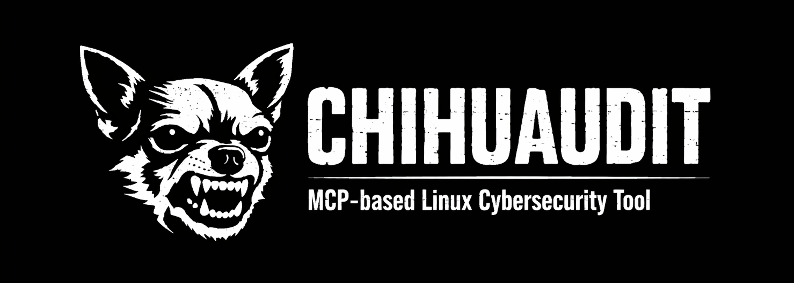

# Chihuaudit



<!-- Build & CI -->
[](https://github.com/girste/CHIHUAUDIT/actions)
[](https://github.com/girste/CHIHUAUDIT/actions/workflows/lint.yml)
[](https://github.com/girste/CHIHUAUDIT/actions/workflows/docker.yml)
[](https://github.com/girste/CHIHUAUDIT/releases)

<!-- Security -->
[](https://github.com/girste/CHIHUAUDIT/security/code-scanning)
[](https://github.com/girste/CHIHUAUDIT/security)
[](https://github.com/girste/CHIHUAUDIT/security)
[](https://securityscorecards.dev/viewer/?uri=github.com/girste/CHIHUAUDIT)
[](https://slsa.dev)

<!-- Code Quality -->
[](https://codecov.io/gh/girste/CHIHUAUDIT)
[](https://goreportcard.com/report/github.com/girste/chihuaudit)

<!-- Version & License -->
[](https://go.dev/)
[](https://github.com/girste/chihuaudit/releases)
[](LICENSE)

**System Configuration Drift Detection for Linux Servers**

Monitor server configuration changes, detect deviations from baseline, and get AI-powered insights.

## What It Does

Chihuaudit continuously monitors your Linux server's system configuration and alerts you when changes occur:

- **Firewall rules** (ufw/iptables/nftables)
- **SSH configuration** (sshd_config changes)
- **Open ports and services** (systemd, network listeners)
- **System users and groups**
- **Critical file permissions** (/etc/passwd, /etc/shadow, etc.)
- **Kernel parameters** (sysctl)
- **Docker containers and security**
- **Cron jobs and scheduled tasks**
- **Security tools** (fail2ban, AppArmor/SELinux)

### Key Features

✅ **Signed Baselines** - Cryptographically signed baseline to prevent tampering  
✅ **Drift Detection** - Automated comparison against known-good state  
✅ **Alert Codes** - Each alert has a unique code (e.g., `FW-001`, `SSH-003`) for tracking and whitelisting  
✅ **AI Insights** - On-demand explanations of what changed and why it matters  
✅ **Discord/Slack Webhooks** - Real-time notifications  
✅ **Git-Friendly Output** - YAML/JSON format for version control integration  
✅ **Whitelist System** - Suppress known-safe changes  

## Tools

**`security_audit`** — Complete system security analysis  
**`start_monitoring`** / **`stop_monitoring`** / **`monitoring_status`** — Continuous monitoring daemon  
**`analyze_anomaly`** — AI anomaly detection analysis  
**`cleanup_old_logs`** — Log rotation  
**`configure_webhook`** / **`test_webhook`** / **`get_notification_config`** — Discord/Slack/custom webhooks  
**`manage_whitelist`** — AI-driven whitelist for false positives  

## Alert System

Real-time security notifications with severity-based anomaly detection. Each alert includes:

- **Unique code** (e.g., `FW-001`, `SSH-003`) for tracking
- **Severity level** (critical, high, medium, low)
- **Category** (firewall, ssh, services, etc.)
- **Detailed message** explaining what changed

**Examples:** [Discord Alert](docs/images/screen-discord.png) | [Full Audit Output](docs/outputs/)

## Installation

**Docker (recommended):**
```bash
docker pull steuuu/chihuaudit:latest
```

**GitHub Container Registry:**
```bash
docker pull ghcr.io/girste/chihuaudit:latest
```

**Binary release:**
```bash
curl -sSfL https://github.com/girste/CHIHUAUDIT/releases/latest/download/chihuaudit_linux_amd64 -o chihuaudit
chmod +x chihuaudit
./chihuaudit audit
```

**Latest release:** [v0.0.1 Teacup](https://github.com/girste/CHIHUAUDIT/releases/latest)

## Security

**Reporting vulnerabilities:** See [SECURITY.md](.github/SECURITY.md)  
**Supported versions:** v0.0.1+  
**SLSA Level 3** supply chain security  

## Contributing

See [CONTRIBUTING.md](CONTRIBUTING.md) for development setup, code standards, and PR guidelines.

---

<div align="center">

[](LICENSE)

**MIT License** — Free and open source  
Contact: **me@girste.com**

</div>
