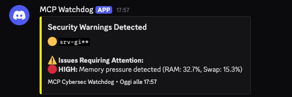

# Chihuaudit

<div align="center">

[](https://github.com/punkpeye/awesome-mcp-servers)

[](https://securityscorecards.dev/viewer/?uri=github.com/girste/CHIHUAUDIT)

</div>


[](https://github.com/girste/CHIHUAUDIT/actions)
[](https://github.com/girste/CHIHUAUDIT/actions/workflows/lint.yml)
[](https://github.com/girste/CHIHUAUDIT/security/code-scanning)
[](https://github.com/girste/CHIHUAUDIT/actions/workflows/trivy.yml)
[](https://www.bestpractices.dev/projects/11858)
[](https://slsa.dev)

**MCP-based Linux Cybersecurity Tool.** Single 8.1MB static binary, zero dependencies.

Analyzes firewall, SSH, fail2ban, Docker, kernel hardening, SSL certificates, network services, and more. Includes continuous monitoring with anomaly detection and EU Vulnerability Database integration.

**Download:** Get the latest binary from [Releases](https://github.com/girste/CHIHUAUDIT/releases) — no compilation needed.

## MCP Tools

- **security_audit** — Complete system security analysis
- **cis_audit** — CIS Benchmark compliance check
- **scan_app_security** — Ports, processes, containers
- **scan_network_security** — Network & firewall rules
- **scan_database_security** — Database exposure & hardening
- **scan_waf_cdn** — WAF/CDN detection & SSL/TLS
- **verify_backup_config** — Backup integrity
- **check_vulnerability_intel** — CVE database lookup (EU Vulnerability Database)
- **start_monitoring** / **stop_monitoring** / **monitoring_status** — Continuous monitoring daemon
- **analyze_anomaly** — AI anomaly detection analysis
- **cleanup_old_logs** — Log rotation
- **configure_webhook** / **test_webhook** / **get_notification_config** — Discord/Slack/custom webhooks
- **manage_whitelist** — AI-driven whitelist for false positives

## Features

### AI-Driven Whitelist
Eliminate false positives with AI-managed `.chihuaudit-whitelist.yaml`. Ask AI to identify false positives → automatic whitelisting → clean results. See `.chihuaudit-whitelist.example.yaml` for template.

### Discord/Slack Webhooks
Customizable security alerts with rich embeds, severity colors, and detailed breakdowns.



## Quick Start

### Docker (Recommended for Production)

**Pull from Docker Hub:**
```bash
docker pull girste/chihuaudit:latest
```

**One-shot security audit:**
```bash
docker run --rm --privileged \
  -v /proc:/host/proc:ro \
  -v /sys:/host/sys:ro \
  -v /etc:/host/etc:ro \
  -v /var/log:/host/var/log:ro \
  -v /var/run/docker.sock:/var/run/docker.sock:ro \
  --network host --pid host \
  girste/chihuaudit:latest audit
```

**Continuous monitoring daemon (with Discord webhooks):**
```bash
# Clone repository for docker-compose
git clone https://github.com/girste/CHIHUAUDIT
cd chihuaudit

# Configure Discord webhook (optional)
cp .chihuaudit.example.yaml .chihuaudit.yaml
# Edit .chihuaudit.yaml with your Discord webhook URL

# Start monitoring daemon
docker-compose up -d chihuaudit-monitor

# Check logs
docker-compose logs -f chihuaudit-monitor

# Stop monitoring
docker-compose down
```

**Environment variables:**
- `MONITOR_INTERVAL`: Seconds between checks (default: 300 = 5 minutes)
- `DOCKER_UID`/`DOCKER_GID`: User/group ID for file permissions (default: 1000:1000)

### Binary Installation

```bash
# Download binary
wget https://github.com/girste/CHIHUAUDIT/releases/latest/download/chihuaudit_linux_amd64.tar.gz
tar xzf chihuaudit_linux_amd64.tar.gz
chmod +x chihuaudit

# Run audit
sudo ./chihuaudit audit

# Or build from source
make build && sudo ./bin/chihuaudit audit
```

📄 **[View all output examples](docs/outputs/)** - Full audit reports, CIS benchmarks, monitoring alerts, webhook notifications.

## Security

**Do not report vulnerabilities via public issues.** Open a [private security advisory](https://github.com/girste/CHIHUAUDIT/security/advisories/new) or DM [@girste](https://github.com/girste).

This tool requires sudo for read-only access to system info (firewall, logs, services). No write operations.

---

[](https://go.dev)
[](https://github.com/girste/CHIHUAUDIT/releases)
[](https://github.com/girste/CHIHUAUDIT/releases)
[](LICENSE)

# Test
